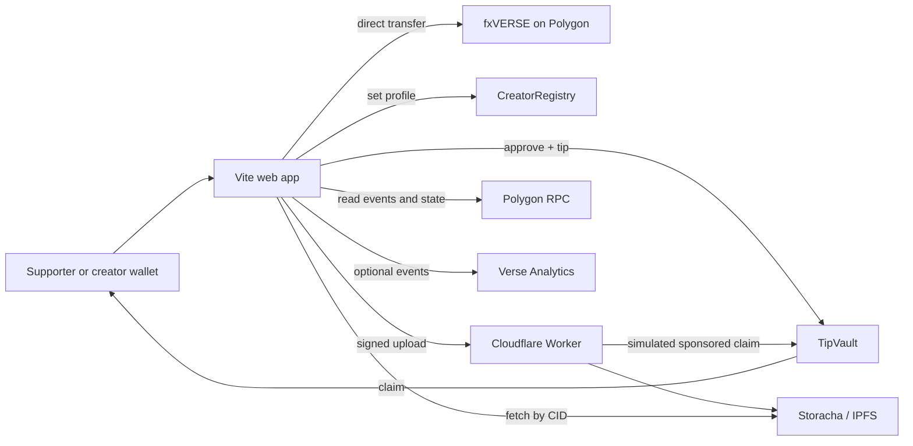

# VerseTip architecture

## Design goals

VerseTip is intentionally onchain-first and database-free. Wallets own profiles, contract state owns balances and campaign rules, IPFS holds public presentation metadata, and event logs provide the durable activity trail. The Worker is replaceable infrastructure rather than the source of truth.

## Settlement rails

### Direct

The supporter calls `fxVERSE.transfer(creator, amount)`. It is the cheapest route and completes in one wallet transaction. It has no message, campaign allocation, or claim batching.

### Claimable vault

The supporter first grants an exact allowance and then calls `TipVault.tip` or `TipVault.tipCampaign`. The vault credits liabilities to creators. Creators can combine many tips into one later claim, so they do not pay gas for every incoming tip. A relayer can submit a creator-signed EIP-712 claim when the creator has no POL.

The allowance transaction means the supporter may use two transactions on the first vault tip. Subsequent tips can reuse remaining allowance. fxVERSE does not expose EIP-2612 permit, so VerseTip does not pretend a one-signature permit path exists.

## Data ownership

- Creator balances and campaign allocations: `TipVault`.
- Slug ownership and current profile metadata CID: `CreatorRegistry`.
- Public profile/campaign text and image: IPFS CID.
- Activity history: Polygon event logs.
- Analytics: aggregate product telemetry only; never authoritative balances.
- Worker state: rate limits and serialized relay execution only.

## Discovery without Supabase

The frontend scans `ProfileUpdated` logs from the registry deployment block, reads the current profile for each unique wallet, rejects inactive profiles, fetches CID-addressed JSON, and verifies that `metadata.publisher` equals the registry wallet. When no registry is configured, the UI shows clearly marked showcase records and disables transactions to them.

At larger scale, replace full-range browser log scans with a trust-minimized indexer or subgraph. The contracts and CIDs remain unchanged, so this optimization does not require a data migration.

## Trust boundaries

- The supporter trusts their wallet display and the exact recipient/contract address shown for signing.
- The vault owner can pause new deposits and recover only token balance above total liabilities. It cannot seize creator claims or pause withdrawals.
- The relayer can submit only valid creator signatures; the production API additionally restricts sponsored payment to the signing wallet.
- The upload service can choose whether to pin content, but cannot change a CID already anchored onchain.
- Public gateways can fail or censor responses, so clients try multiple gateways and retain the canonical `ipfs://` URI.

